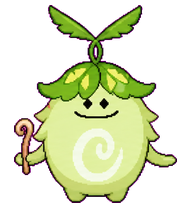
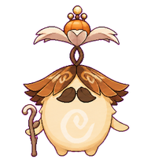
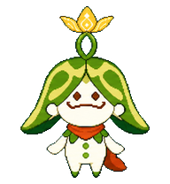
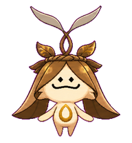
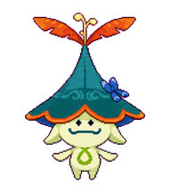
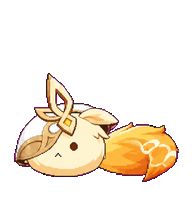
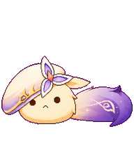

# Genshin Codex Pets

<table>
  <thead>
    <tr>
      <th>Preview</th>
      <th>Name</th>
      <th>Description</th>
    </tr>
  </thead>
  <tbody>
    <tr>
      <th colspan="3" align="left">Aranara / 兰那罗</th>
    </tr>
    <tr>
      <td></td>
      <td>Arabalika / 兰百梨迦</td>
      <td>Arabalika for fearless cleanup.</td>
    </tr>
    <tr>
      <td></td>
      <td>Araja / 兰拉迦</td>
      <td>Araja for sheltering dreams.</td>
    </tr>
    <tr>
      <td></td>
      <td>Arakavi / 兰加惟</td>
      <td>Arakavi for remembered songs.</td>
    </tr>
    <tr>
      <td></td>
      <td>Arama / 兰罗摩</td>
      <td>Arama for brave new growth.</td>
    </tr>
    <tr>
      <td></td>
      <td>Aramuhukunda / 兰穆护昆达</td>
      <td>Aramuhukunda for ancient resolve.</td>
    </tr>
    <tr>
      <td></td>
      <td>Arana / 兰拉娜</td>
      <td>Arana for gentle protection.</td>
    </tr>
    <tr>
      <td></td>
      <td>Aranaga / 兰纳迦</td>
      <td>Aranaga for healing memories.</td>
    </tr>
    <tr>
      <td></td>
      <td>Arapacati / 兰帕卡提</td>
      <td>Arapacati for kitchen harmony.</td>
    </tr>
    <tr>
      <td></td>
      <td>Ararycan / 兰利遮</td>
      <td>Ararycan for careful forest care.</td>
    </tr>
    <tr>
      <th colspan="3" align="left">Dodoco / 嘟嘟可</th>
    </tr>
    <tr>
      <td></td>
      <td>Dodoco Alice / 艾莉丝</td>
      <td>Dodoco Alice for bold experiments.</td>
    </tr>
    <tr>
      <td></td>
      <td>Dodoco Rhinedottir / 莱茵多特</td>
      <td>Dodoco Rhinedottir for impossible alchemy.</td>
    </tr>
    <tr>
      <td></td>
      <td>Dodoco Andersdotter / 安德斯多特</td>
      <td>Dodoco Andersdotter for stories that stay.</td>
    </tr>
    <tr>
      <td></td>
      <td>Dodoco Barbeloth / 芭比洛斯</td>
      <td>Dodoco Barbeloth for clear foresight.</td>
    </tr>
    <tr>
      <td></td>
      <td>Dodoco Nicole / 尼可</td>
      <td>Dodoco Nicole for quiet guidance.</td>
    </tr>
    <tr>
      <th colspan="3" align="left">Other characters</th>
    </tr>
    <tr>
      <td></td>
      <td>Sandrone / 桑多涅</td>
      <td>Sandrone for mechanical precision.</td>
    </tr>
  </tbody>
</table>
